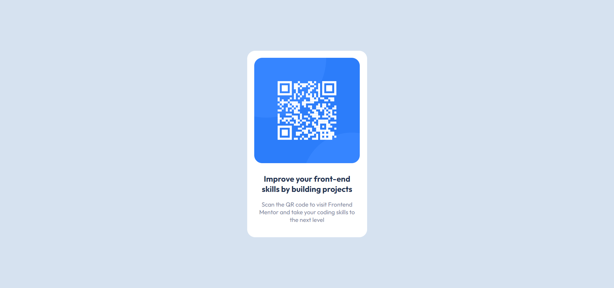

# Frontend Mentor - QR code component solution

This is a solution to the [QR code component challenge on Frontend Mentor](https://www.frontendmentor.io/challenges/qr-code-component-iux_sIO_H). Frontend Mentor challenges help you improve your coding skills by building realistic projects.

## Screenshot

## Links

- Live Site URL: (https://qr-code-component-km9.netlify.app/)

## Built with

- HTML5
- SASS/SCSS

## Author

- Frontend Mentor - (https://www.frontendmentor.io/profile/k-malkiewicz)
- Codewars - (https://www.codewars.com/users/k_malkiewicz)
- iCodeThis - (https://www.icodethis.com/BAGI3TA)